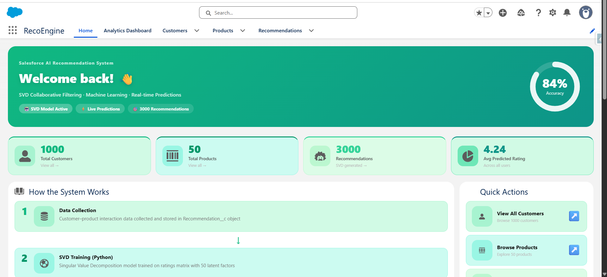
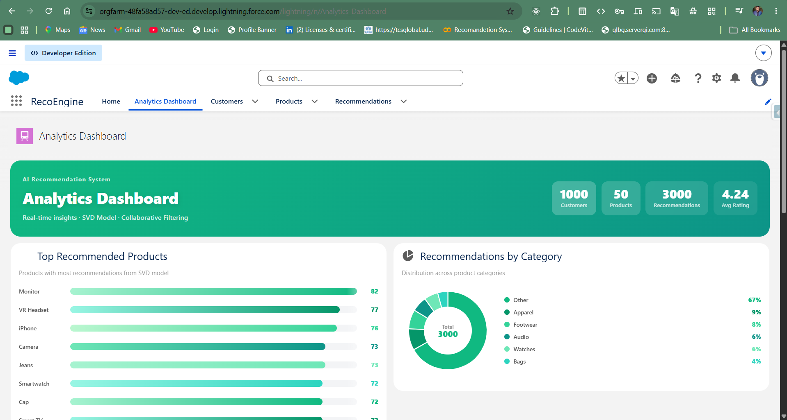
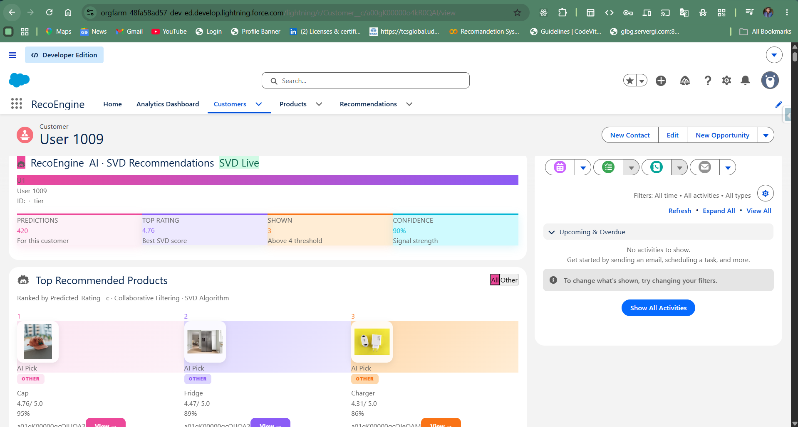
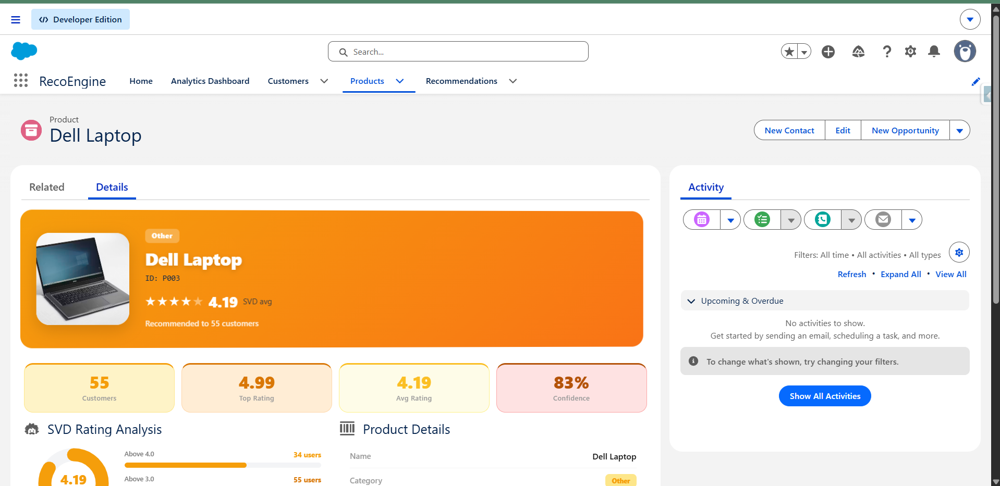
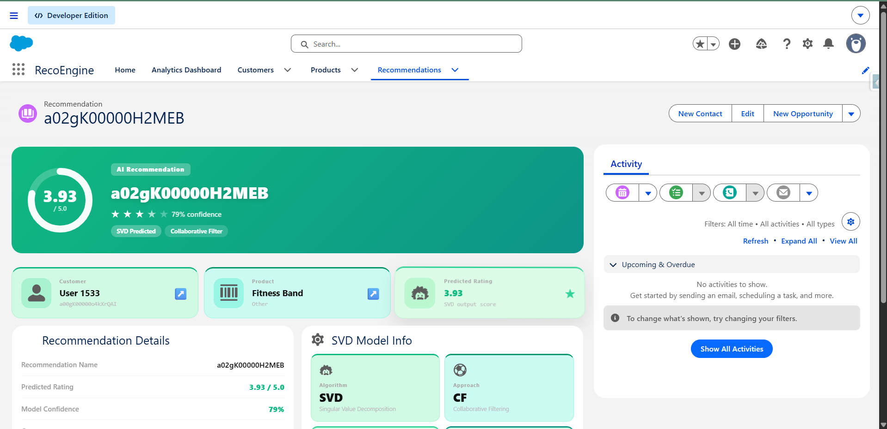

# SalesforceRecoEngine

## Overview
This project is a Product Recommendation System developed using Machine Learning and Salesforce CRM. The system analyzes customer-product interactions and generates personalized product recommendations.

## Features
- Personalized Product Recommendations
- Customer and Product Management
- Salesforce Custom Objects
- Lightning Web Components (LWC) User Interface
- Apex Controllers and SOQL Queries
- Recommendation Dashboard

## Technologies Used
- Salesforce CRM
- Apex
- Lightning Web Components (LWC)
- SOQL
- Python
- Machine Learning (SVD Collaborative Filtering)

## Project Architecture

Customer Data
      ↓
Machine Learning Model (SVD)
      ↓
Predicted Ratings
      ↓
Salesforce Custom Objects
      ↓
Recommendation Dashboard (LWC)

## Salesforce Objects

### Customer__c
Stores customer information.

### Product__c
Stores product details and categories.

### Recommendation__c
Stores recommended products and predicted ratings for customers.

## Machine Learning Model
The recommendation engine uses Collaborative Filtering with Singular Value Decomposition (SVD) to predict customer preferences and generate recommendations.

## Future Enhancements
- Real-time recommendations
- Hybrid recommendation model
- Product search and filtering
- Advanced analytics dashboard

## Author
Chandr Pratap
B.Tech CSE
ITS Engineering College, Greater Noida

## Screenshots

### Home Page

This page serves as the landing page of the application and provides navigation to Customers, Products, Recommendations, and Analytics Dashboard.

---

### Analytics Dashboard

The Analytics Dashboard displays key business metrics including total customers, total products, total recommendations, average rating, top recommended products, and category-wise recommendation distribution.

---

### Customer Management

This module manages customer records and stores customer information used by the recommendation engine.

---

### Product Management

This module stores product details, categories, and product information used for generating recommendations.

---

### Recommendation Details

This page displays personalized recommendations generated by the SVD-based collaborative filtering model, including predicted ratings, confidence score, algorithm information, and customer-product mapping.

# Salesforce DX Project: Next Steps

Now that you’ve created a Salesforce DX project, what’s next? Here are some documentation resources to get you started.

## How Do You Plan to Deploy Your Changes?

Do you want to deploy a set of changes, or create a self-contained application? Choose a [development model](https://developer.salesforce.com/tools/vscode/en/user-guide/development-models).

## Configure Your Salesforce DX Project

The `sfdx-project.json` file contains useful configuration information for your project. See [Salesforce DX Project Configuration](https://developer.salesforce.com/docs/atlas.en-us.sfdx_dev.meta/sfdx_dev/sfdx_dev_ws_config.htm) in the _Salesforce DX Developer Guide_ for details about this file.

## Read All About It

- [Salesforce Extensions Documentation](https://developer.salesforce.com/tools/vscode/)
- [Salesforce CLI Setup Guide](https://developer.salesforce.com/docs/atlas.en-us.sfdx_setup.meta/sfdx_setup/sfdx_setup_intro.htm)
- [Salesforce DX Developer Guide](https://developer.salesforce.com/docs/atlas.en-us.sfdx_dev.meta/sfdx_dev/sfdx_dev_intro.htm)
- [Salesforce CLI Command Reference](https://developer.salesforce.com/docs/atlas.en-us.sfdx_cli_reference.meta/sfdx_cli_reference/cli_reference.htm)

